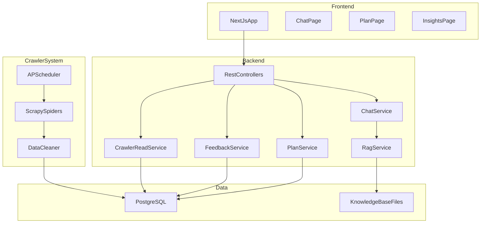

# Architecture

## 1. System overview

Cyber Guide uses a multi-service architecture designed for interview-ready fullstack practice:

- `frontend` (Next.js 15): UI and user interaction
- `backend` (Spring Boot 3): core business APIs
- `crawler` (Python): scheduled ingestion pipeline
- `postgres` (PostgreSQL 16): unified data storage

## 2. High-level diagram

## 3. Request flow examples

### 3.1 Chat request

1. frontend sends `POST /api/chat`
2. backend validates request and rate limits
3. moderation layer checks crisis keywords
4. rag service retrieves evidence from local markdown and db
5. ai client calls OpenAI-compatible endpoint
6. backend streams response chunks to frontend

### 3.2 Plan generation

1. frontend sends `POST /api/plan/generate`
2. backend builds task prompt from recent context
3. ai returns 7 tasks, backend validates length and format
4. fallback tasks are used when ai output is invalid
5. tasks upserted into `study_plans` and `plan_days`

### 3.3 Crawler ingestion

1. scheduler triggers source-specific spider
2. spider fetches and parses public pages
3. cleaner normalizes content and removes duplicates
4. records inserted into `crawled_articles`
5. backend reads latest records for frontend insights

## 4. Backend module boundaries

- `controller`: request/response contracts only
- `service`: business workflows and orchestration
- `repository`: database access
- `ai`: model invocation and retry strategy
- `rag`: retrieval, scoring, evidence formatting
- `security`: rate limiting and request validation

## 5. Data boundaries

- chat records, plans, feedback, crawler data all in PostgreSQL
- local knowledge base remains in `knowledge_base/skills/*.md`
- pii redaction happens before persistence

## 6. Runtime and environment strategy

- development:
  - Mac (Apple Silicon), Docker Compose for all services
- production:
  - Linux server with Docker Compose + Nginx reverse proxy
  - crawler runs as always-on scheduled container

## 7. Observability

- structured logs with request id
- health check endpoints:
  - backend: `/actuator/health`
  - frontend: `/api/health` (optional)
- optional metrics export for latency/error tracking

## 8. Resilience strategy

- ai timeout and retry bounds
- fallback models and fallback plan tasks
- graceful degradation:
  - chat can work without crawler data
  - plan endpoints return explicit error codes
