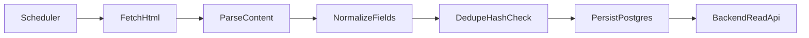

# Crawler Module Design

## 1. Goals

- gather public study/career planning content on schedule
- normalize and deduplicate records
- expose high-quality records to backend APIs
- provide evidence inputs for chat and planning suggestions

## 2. Scope

In scope:

- public pages and forum posts with clear planning relevance
- metadata extraction (title, summary, url, tags, published time)
- periodic ingestion and retries

Out of scope:

- bypassing strong anti-bot controls
- crawling private/authenticated content
- storing full copyrighted long-form content when not required

## 3. Target sources (initial)

- Zhihu public discussions
- NowCoder public experience posts
- CSDN / Juejin public technical planning posts
- V2EX public career-related discussions

Note: each source adapter must be configurable and can be disabled.

## 4. Pipeline

## 5. Data model mapping

- source config -> `crawl_sources`
- parsed article -> `crawled_articles`
- dedupe key:
  - `sha256(normalized_title + normalized_url_host + day_bucket)`

## 6. Runtime behavior

- scheduler default cadence: every 6 hours
- per-source timeout and retry:
  - request timeout 10s
  - max retries 2
- global crawl lock to avoid overlap jobs

## 7. Quality filter

Each item receives `quality_score` based on:

- title relevance to planning keywords
- content length quality window
- source trust baseline
- duplicate confidence penalty

Only records over threshold are returned to frontend by default.

## 8. Operational controls

- env flags:
  - `CRAWLER_ENABLED=true|false`
  - `CRAWLER_INTERVAL_MINUTES=360`
  - `CRAWLER_MAX_PAGES_PER_SOURCE=3`
- manual run:
  - `python run.py --once`
- dry run:
  - `python run.py --once --dry-run`

## 9. Legal and ethical constraints

- crawl public pages only
- set identifiable user-agent
- honor robots rules where applicable
- keep crawl rate conservative
- provide source attribution in UI/api output
