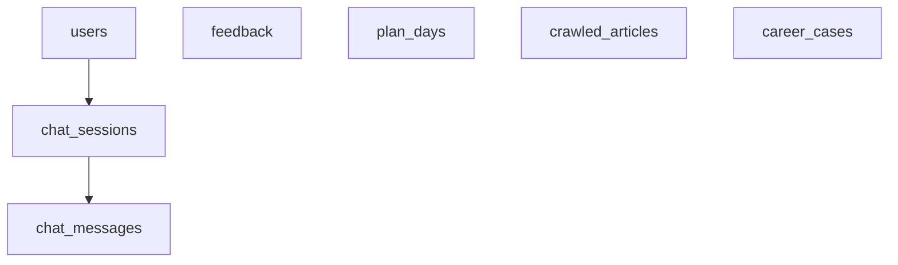

# Database Design

Database engine: **PostgreSQL 16** (see `docker-compose.yml` / deployment).

Schema is driven by **Spring Data JPA** entities under `backend/src/main/java/com/cyberguide/model/`. The following reflects the current application model (not legacy Supabase drafts).

## 1. Core tables

### 1.1 `users`

| Column | Type | Notes |
|--------|------|--------|
| `id` | uuid, PK | |
| `email` | varchar(255), unique, not null | |
| `password_hash` | varchar(255) | null for GitHub-only users |
| `nickname` | varchar(64) | |
| `avatar_url` | varchar(512) | |
| `github_id` | varchar(64), unique | OAuth subject |
| `profile_json` | text | structured profile / preferences JSON |
| `created_at` | timestamptz | |
| `updated_at` | timestamptz | |

### 1.2 `chat_sessions`

| Column | Type | Notes |
|--------|------|--------|
| `id` | uuid, PK | |
| `user_id` | uuid, nullable | set when logged in |
| `session_id` | varchar(128) | client anonymous session key / correlation |
| `title` | varchar(120), not null | |
| `mode` | varchar(32), not null | e.g. default / scenario |
| `created_at` / `updated_at` | timestamptz | |

### 1.3 `chat_messages`

| Column | Type | Notes |
|--------|------|--------|
| `id` | uuid, PK | |
| `session_id` | uuid, FK → `chat_sessions.id` | JPA: `ChatMessageEntity.session` |
| `role` | varchar(16), not null | user / assistant |
| `content` | text, not null | |
| `is_crisis` | boolean, not null | |
| `seq` | int, not null | ordering within session |
| `evidence_json` | text | JSON array of RAG evidence for assistant turns |
| `created_at` | timestamptz | |

### 1.4 `feedback`

| Column | Type | Notes |
|--------|------|--------|
| `id` | uuid, PK | |
| `session_id` | varchar(128) | |
| `user_id` | uuid, nullable | |
| `rating` | int, not null | |
| `feedback_redacted` | text | |
| `quality_score` | double | |
| `quality_tier` | varchar(16) | |
| `conversation_turns` | int | |
| `had_crisis` | boolean | |
| `mode` | varchar(32) | |
| `redacted_messages` | text | optional snapshot |
| `created_at` | timestamptz | |

### 1.5 `plan_days`

Seven-day micro-plan tasks keyed by browser/session (and optional `user_id`).

| Column | Type | Notes |
|--------|------|--------|
| `id` | uuid, PK | |
| `session_id` | varchar(128), not null | |
| `user_id` | uuid, nullable | |
| `day_index` | int, not null | 1..7 |
| `task_text` | varchar(80), not null | |
| `status` | varchar(16), not null | todo / done / skipped |
| `created_at` / `updated_at` | timestamptz | |

Unique: (`session_id`, `day_index`).

### 1.6 `crawled_articles`

Crawler pipeline output for RAG / admin.

| Column | Type | Notes |
|--------|------|--------|
| `id` | uuid, PK | |
| `source_name` | varchar(64), not null | spider name, e.g. `zhihu` |
| `url` | text, not null | unique in practice via `dedupe_hash` |
| `title` | varchar, not null | |
| `summary` | text | |
| `content_snippet` | text | |
| `category` | varchar(32) | baoyan / kaoyan / job / study_abroad / … |
| `language` | varchar(16) | default `zh` |
| `published_at` | timestamptz | nullable |
| `crawl_time` | timestamptz, not null | |
| `quality_score` | double | |
| `relevance_tier` | varchar(16) | high / medium / low |
| `dedupe_hash` | varchar(64), not null, unique | |

### 1.7 `career_cases`

AI-extracted structured cases (from high-quality crawled content), used for **similar case** retrieval.

| Column | Type | Notes |
|--------|------|--------|
| `id` | uuid, PK | |
| `source` | varchar(64), not null | |
| `url` | text, not null | |
| `title` | varchar(512), not null | |
| `content` | text | |
| `category` | varchar(32), not null | |
| `background` / `result` / `tags` | text | structured fields |
| `quality_score` | double | |
| `dedupe_hash` | varchar(64), not null, unique | |
| `crawl_time` | timestamptz | |

## 2. ER diagram (simplified)

## 3. Migration strategy

1. Use JPA `ddl-auto` or explicit Flyway/Liquibase in production (project may use `update` in dev — confirm `application.yml`).
2. Backup before schema changes; crawler tables can be large — index `dedupe_hash` and `source_name` for maintenance jobs.

## 4. Query considerations

- Hot paths: load messages by `chat_sessions.id` ordered by `seq`; list sessions by `user_id` + `updated_at`.
- RAG: query `crawled_articles` / `career_cases` by category + text match (see `RagService`).

## 5. Security and privacy

- Prefer storing **redacted** content in feedback / analytics fields.
- Never persist API keys or raw `Authorization` headers.
- Limit crawler row size in pipelines to avoid abuse.
