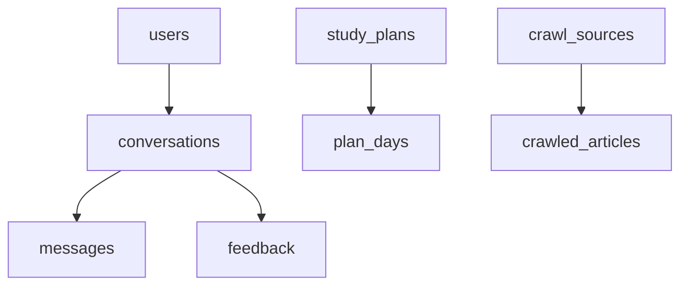

# Database Design

Database engine: PostgreSQL 16

## 1. Core tables

### 1.1 `users`

- `id` (uuid, pk)
- `created_at` (timestamptz)
- `updated_at` (timestamptz)
- `anonymous_id` (varchar, unique)
- `profile_json` (jsonb)

### 1.2 `conversations`

- `id` (uuid, pk)
- `session_id` (varchar, index)
- `user_id` (uuid, nullable)
- `mode` (varchar)
- `had_crisis` (boolean)
- `created_at` (timestamptz)

### 1.3 `messages`

- `id` (uuid, pk)
- `conversation_id` (uuid, fk -> conversations.id)
- `role` (varchar)
- `content_redacted` (text)
- `token_estimate` (int)
- `created_at` (timestamptz)

Indexes:

- `idx_messages_conversation_id`
- `idx_messages_created_at`

### 1.4 `feedback`

- `id` (uuid, pk)
- `conversation_id` (uuid, fk)
- `rating` (int check 1..10)
- `feedback_redacted` (text)
- `quality_score` (numeric)
- `quality_tier` (varchar)
- `created_at` (timestamptz)

### 1.5 `study_plans`

- `id` (uuid, pk)
- `session_id` (varchar, unique)
- `context_snapshot` (text)
- `today_index` (int default 1)
- `created_at` (timestamptz)
- `updated_at` (timestamptz)

### 1.6 `plan_days`

- `id` (uuid, pk)
- `plan_id` (uuid, fk -> study_plans.id)
- `day_index` (int check 1..7)
- `task_text` (varchar(80))
- `status` (varchar: todo/done/skipped)
- `created_at` (timestamptz)
- `updated_at` (timestamptz)

Constraints:

- unique(`plan_id`, `day_index`)

### 1.7 `crawl_sources`

- `id` (uuid, pk)
- `name` (varchar, unique)
- `base_url` (varchar)
- `enabled` (boolean)
- `crawl_interval_minutes` (int)
- `last_crawled_at` (timestamptz, nullable)
- `created_at` (timestamptz)

### 1.8 `crawled_articles`

- `id` (uuid, pk)
- `source_id` (uuid, fk -> crawl_sources.id)
- `source_name` (varchar, index)
- `url` (varchar, unique)
- `title` (varchar)
- `summary` (text)
- `content_snippet` (text)
- `tags` (text[])
- `language` (varchar)
- `published_at` (timestamptz, nullable)
- `crawl_time` (timestamptz)
- `quality_score` (numeric)
- `dedupe_hash` (varchar, index)

### 1.9 `knowledge_entries`

- `id` (uuid, pk)
- `source` (varchar)
- `chunk_text` (text)
- `keywords` (text[])
- `created_at` (timestamptz)

## 2. ER diagram

## 3. Migration strategy

1. create new postgres schema
2. keep old supabase tables read-only for comparison window
3. dual-write optional period (if needed)
4. switch frontend read path to new backend
5. deprecate old storage after data validation

## 4. Query considerations

- plan fetch by `session_id` is hot path
- crawler list by `source_name`, `published_at desc`
- add partial index for enabled sources:
  - `where enabled = true`

## 5. Security and privacy

- store redacted message/feedback only
- never persist api keys or raw auth headers
- restrict crawler content size to prevent abuse
